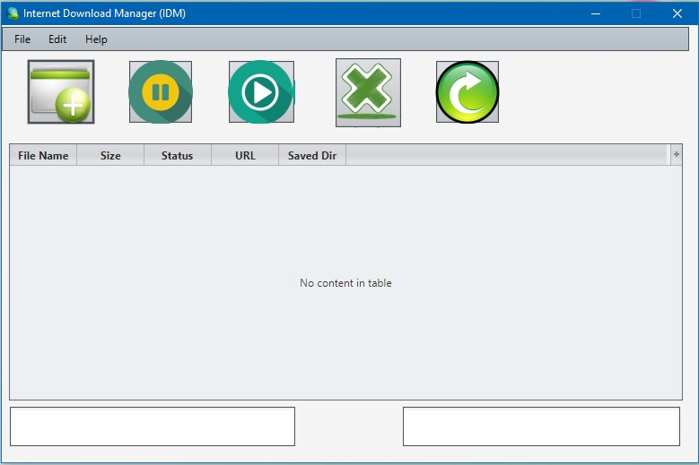
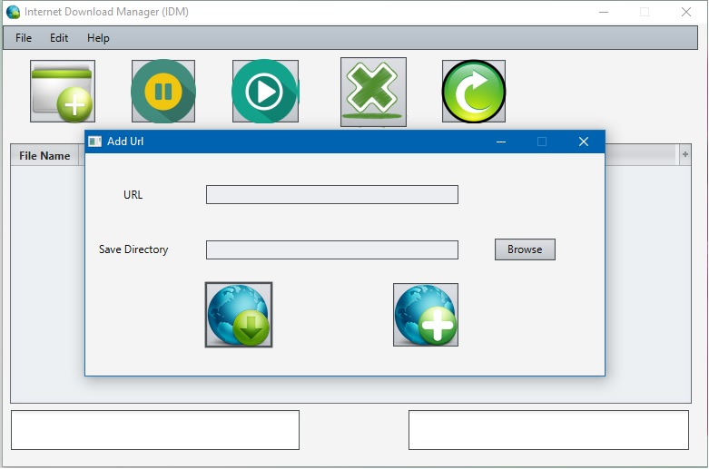
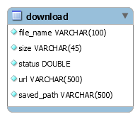

# Internet Download Manager (IDM)

##### Multi Threaded IDM Using JavaFX

## Features

* Using **MySQL** database for saving download details

* _**Multi Threaded**_ IDM

* User can _**pause**_, _**resume**_, _**restart**_ and _**delete**_ downloads

* Supports _**any**_ file type

## Previews

_**Main Window**_

_**Add Url Window**_

## Database

* Run `database/db.sql` in **MySQLWorkbench** for creating download table
 
 
